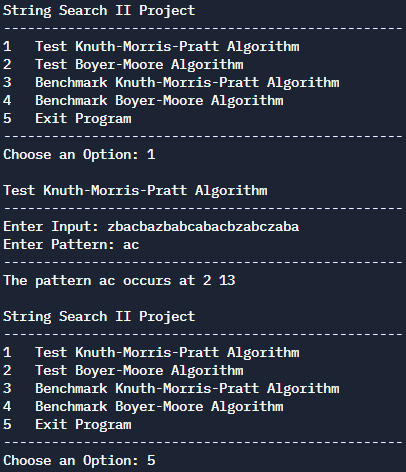

# CSC 212 Final Project (String Search II)

Our group worked together to complete the **String Search II** project, which implements
and benchmarks two algorithms used to identify the starting index of all occurances of a given pattern. For example, in the string ``"abcaaaaaaabcaaa"``, the pattern ``"abc"``
would occur starting at index 0 and index 9.    

## Setup
**1.** Open your terminal in the proper directory.  
**2.** Compile - ``g++ main.cpp -o main``.  
**3.** Run the program - ``./main``.  
**4.** You will be prompted with the program menu; choose your options and voilà!

## Example Execution

### Contributors
Mike Cavallaro  
Matt Hogan