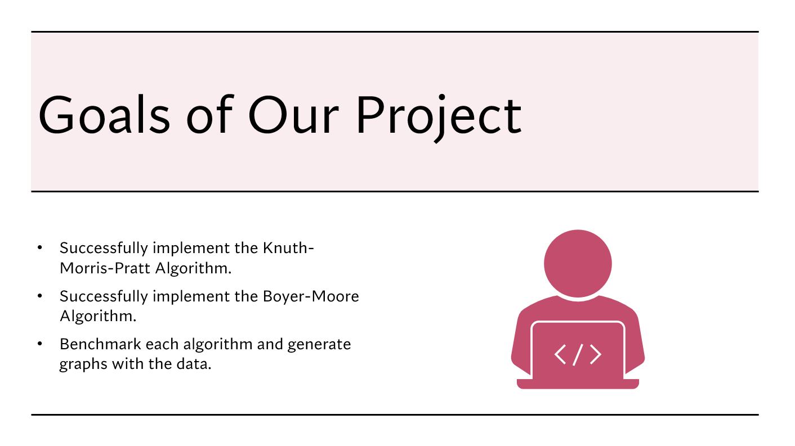

# CSC 212 Final Project
Our group worked together to complete the **String Search II** project, which implements
and benchmarks two algorithms used to identify the starting index of all occurances of a given pattern. For example, in the string ``"abcaaaaaaabcaaa"``, the pattern ``"abc"``
would occur starting at index 0 and index 9.    

## I. The Knuth-Morris-Pratt Algorithm
explanation

## II. The Boyer-Moore Algorithm
explanation

## Benchmarking
explanation